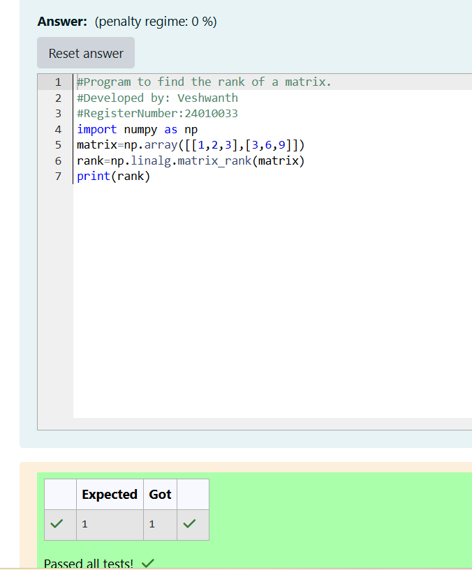

# RANK-OF-A-MATRIX
## Aim:
To write a python program to find the rank of a matrix
## Equipment’s required:
1. 	Hardware – PCs
2. 	Anaconda – Python 3.7 Installation / Moodle-Code Runner
## Algorithm:
### Step 1:import numpy from python library use import numpy as np 
### Step 2:create a variable matrix to compute the rank of that matrix as nested list 
### Step 3: Using the np.linalg.matrix_rank(), we can find the rank of the given matrix.
### Step 4:print the variable matrix to return the result of rank of matrix 
## Program:

```
#Program to find the rank of a matrix.
#Developed by: Veshwanth
#RegisterNumber:24010033
import numpy as np
matrix=np.array([[1,2,3],[3,6,9]])
rank=np.linalg.matrix_rank(matrix)
print(rank)

```
## Output:

## Result:
Thus the rank for the given matrix is successfully solved by  using a python program.

